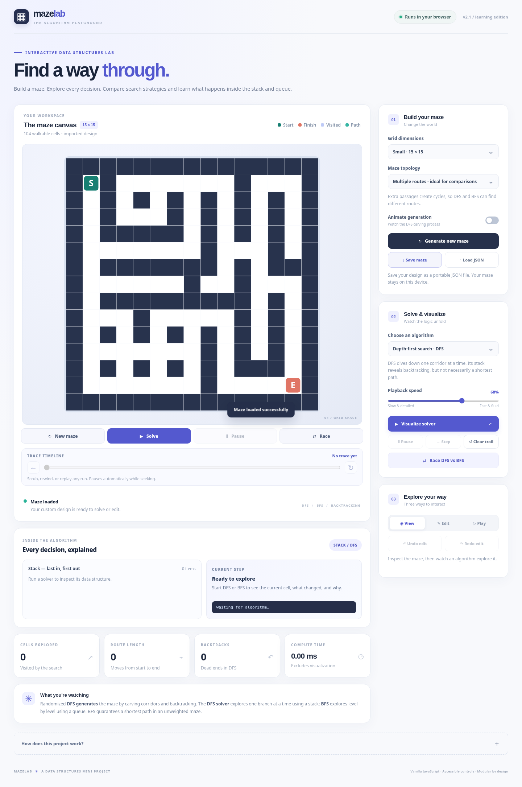
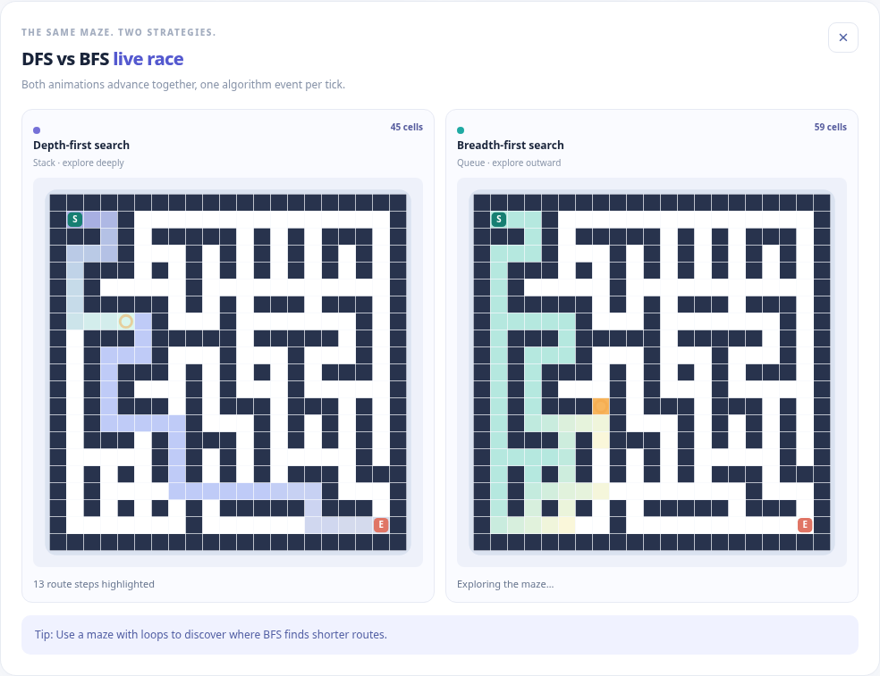

# MazeLab — Maze Generation & Algorithm Visualizer

**An interactive Data Structures mini-project built to make maze generation, DFS, and BFS easy to see and understand.** Generate new mazes, follow each algorithm's decisions, compare their performance, or solve a maze yourself.

Built with **HTML, CSS, and vanilla JavaScript (ES modules)**. No backend or database is required.

## Preview





## Features

- **Random maze generation:** Build solvable mazes using randomized DFS and backtracking.
- **Two maze styles:** Choose a perfect maze (one unique route) or introduce loops for multiple possible routes.
- **Animated DFS and BFS:** Watch search, visited cells, backtracking, and the final route.
- **Stack and queue inspector:** See the actual frontier contents and the current algorithm decision.
- **Timeline controls:** Pause, resume, step, rewind, replay, and change playback speed.
- **DFS vs BFS race:** Run both algorithms side by side on the same maze and compare explored cells, route length, and computation time.
- **Maze editor:** Add or remove walls, move the start and finish, and undo/redo edits.
- **Play mode:** Navigate with arrow keys, WASD, or on-screen directional controls.
- **Save and load:** Export a maze as JSON and import it later.
- **Responsive layout:** Use the application on desktop and mobile devices.

## Data Structures and Algorithms

| Part of MazeLab | Technique | Purpose |
| --- | --- | --- |
| Maze generator | Randomized DFS + stack | Carve corridors and backtrack from dead ends |
| DFS solver | Stack | Explore one path deeply before backtracking |
| BFS solver | Queue | Explore cells level by level |
| Maze representation | Grid graph | Represent open cells as vertices and adjacent passages as edges |
| Edit history | Two stacks | Support undo and redo |

**DFS vs BFS:** Both have **O(V + E)** time complexity for a graph with *V* vertices and *E* edges. BFS guarantees a shortest path in an unweighted maze; DFS finds a valid path but not necessarily the shortest one.

> **Why offer multiple routes?** A perfect maze has only one simple route between two points, so DFS and BFS will return the same path length. Adding loops makes route-length comparisons more interesting, although the algorithms will not differ in every maze.

## Getting Started

### Requirements

- A modern web browser
- **Python 3** to serve the static files locally
- **Node.js** only if you want to run the automated tests

### Run on Windows

1. Download or clone the repository.
2. Open the project folder.
3. Double-click **`start-server.bat`**.
4. Open **http://localhost:8000** if your browser does not open automatically.

### Run on macOS or Linux

From the project folder, run:

```bash
sh start-server.sh
```

Or use:

```bash
python3 -m http.server 8000
```

Then visit **http://localhost:8000**.

> The project uses JavaScript ES modules. Run it through a local web server rather than opening `index.html` with `file://`.

## How to Use

1. Choose a **maze size** and **maze topology**, then select **Generate new maze**.
2. Choose **DFS** or **BFS** and click **Visualize solver**.
3. Use the **timeline** to inspect individual steps and the **stack/queue panel** to understand each decision.
4. Click **Race DFS vs BFS** to see both algorithms solve the same maze.
5. Try **Edit** mode to change the graph or **Play** mode to solve it yourself.
6. Use **Save maze** to export your layout as a JSON file.

## Project Structure

```text
MazeLab-v2.1/
├── index.html              # Page layout
├── styles.css              # Styling and responsive design
├── js/
│   ├── main.js             # Application controller and event handling
│   ├── core/
│   │   ├── maze.js         # Grid model and maze generation
│   │   ├── search.js       # DFS and BFS solvers
│   │   ├── timeline.js     # Animation playback and seeking
│   │   ├── history.js      # Undo/redo
│   │   └── io.js           # JSON import/export
│   └── ui/
│       ├── renderer.js     # Canvas rendering
│       └── view.js         # UI updates and algorithm inspector
├── tests/                  # Automated tests
├── preview-desktop.png     # Screenshot
├── preview-mobile.png      # Screenshot
├── preview-race.png        # Screenshot
├── package.json
├── start-server.bat
├── start-server.sh
└── README.md
```

The **core** modules contain the algorithms and data structures; **ui** modules handle rendering and presentation; **main.js** coordinates user interactions. This separation makes the project easier to test and extend.

## Testing

Install Node.js, then run:

```bash
npm test
```

The project currently contains **16 automated tests** covering maze properties, solver correctness, BFS shortest paths, trace data, import/export, undo/redo, and animation timeline behavior.

## Deployment

MazeLab is a **static website**. You can host it on **Vercel**, **Netlify**, or **GitHub Pages**.

**Vercel:** Push the project files to a GitHub repository, import the repository at [vercel.com/new](https://vercel.com/new), select **Other** as the framework preset, and deploy without a build command. Keep `index.html` at the repository root.

## Future Improvements

- A* and Dijkstra's algorithm visualizations
- More maze-generation methods (Prim's and Kruskal's)
- More detailed side-by-side stack/queue inspection during races
- Exportable performance comparisons

## Educational Purpose

MazeLab was created as a **Data Structures mini-project** to demonstrate graph traversal, stacks, queues, backtracking, and interactive algorithm visualization.
